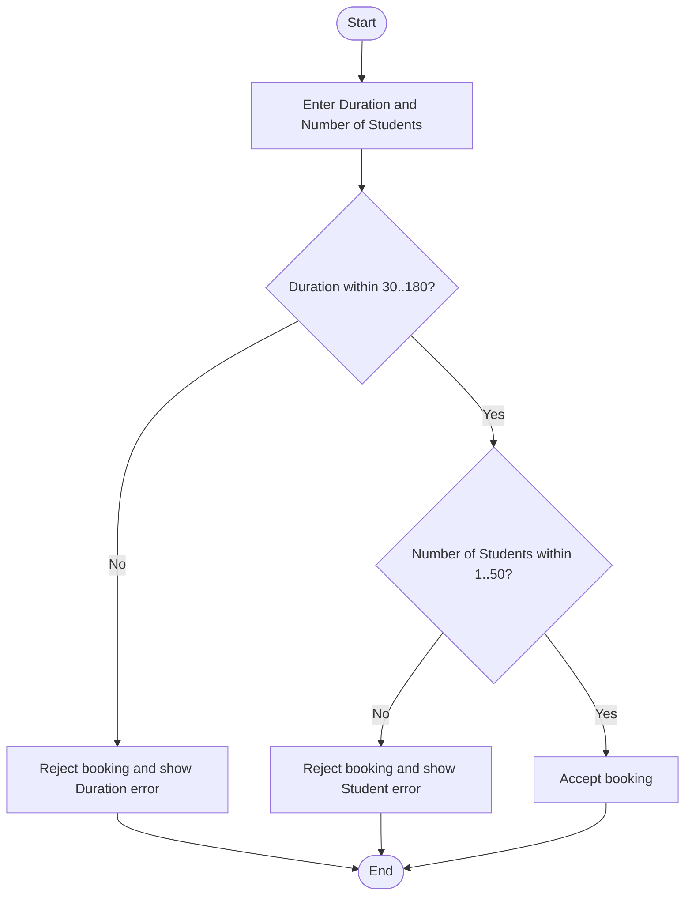

# Exercise 11267: Room Booking Validation with BVA

import HintCallout from '@site/src/components/HintCallout';

An university room booking system lets users register a room booking by entering the following data:

| Data field | Description | Valid range |
|---|---|---|
| `Duration` | Room usage duration in minutes | `30 <= Duration <= 180` |
| `Number of Students` | Number of participating students | `1 <= Number of Students <= 50` |

The system applies these validation rules:

- If `Duration` is less than 30 or greater than 180, the request must be rejected and an error message displayed.
- If `Number of Students` is less than 1 or greater than 50, the request must be rejected and an error message displayed.
- A booking request is accepted only when both fields are within their valid ranges.

Assume the following nominal values:

- The nominal value of `Duration` is 90 minutes.
- The nominal value of `Number of Students` is 25 students.

## Question

Using Boundary Value Analysis (BVA), design test sets for the system above by applying the following four methods in order: Normal BVA, Robust BVA, Worst-case BVA, and Robust Worst-case BVA.

For each method:

- Explain how to calculate the number of generated test cases.
- Identify the test values selected for each variable.
- Present the test cases in table form.

## Activity Diagram

<HintCallout title="Approach guide">

Start by listing the valid range and nominal value of each input variable.

- For **Normal BVA**, choose the boundary values and the values just inside the boundary, then vary one variable at a time while keeping the others at nominal values.
- For **Robust BVA**, add the values just outside each valid boundary so you can test both valid and invalid edge cases.
- For **Worst-case BVA**, take all combinations of the selected valid boundary values across all variables.
- For **Robust Worst-case BVA**, take all combinations of the valid, near-boundary, and out-of-range values across all variables.

A useful shortcut is to calculate the test case count first, then build the table row by row from the selected value sets.

</HintCallout>

## Sample Answer

To design BVA test sets, we first identify the valid ranges, the nominal values, and then derive boundary values for each input variable.

There are 2 input variables:

| Variable | Valid range | Nominal value |
|---|---|---:|
| `Duration` | 30 to 180 | 90 |
| `Number of Students` | 1 to 50 | 25 |

The system accepts the booking when both `Duration` and `Number of Students` are valid. If one or both variables are invalid, the system shows the corresponding error.

### Normal BVA

Normal BVA checks valid boundary values and near-boundary valid values, changing only one variable at a time while keeping the other at nominal values.

For each variable, choose 5 values:

| Variable | Normal BVA values |
|---|---|
| `Duration` | 30, 31, 90, 179, 180 |
| `Number of Students` | 1, 2, 25, 49, 50 |

$$
4n + 1 = 4 \times 2 + 1 = 9 \text{ test cases}
$$

The test set is:

| Test case | Duration | Number of Students | Expected result |
|---|---:|---:|---|
| TC-001 | 90 | 25 | Accept booking |
| TC-002 | 30 | 25 | Accept booking |
| TC-003 | 31 | 25 | Accept booking |
| TC-004 | 179 | 25 | Accept booking |
| TC-005 | 180 | 25 | Accept booking |
| TC-006 | 90 | 1 | Accept booking |
| TC-007 | 90 | 2 | Accept booking |
| TC-008 | 90 | 49 | Accept booking |
| TC-009 | 90 | 50 | Accept booking |

### Robust BVA

Robust BVA checks both valid values and invalid values just outside the boundaries.

| Variable | Robust BVA values |
|---|---|
| `Duration` | 29, 30, 31, 90, 179, 180, 181 |
| `Number of Students` | 0, 1, 2, 25, 49, 50, 51 |

$$
6n + 1 = 6 \times 2 + 1 = 13 \text{ test cases}
$$

The test set is:

| Test case | Duration | Number of Students | Expected result |
|---|---:|---:|---|
| TC-001 | 90 | 25 | Accept booking |
| TC-002 | 29 | 25 | Error: invalid `Duration` |
| TC-003 | 30 | 25 | Accept booking |
| TC-004 | 31 | 25 | Accept booking |
| TC-005 | 179 | 25 | Accept booking |
| TC-006 | 180 | 25 | Accept booking |
| TC-007 | 181 | 25 | Error: invalid `Duration` |
| TC-008 | 90 | 0 | Error: invalid `Number of Students` |
| TC-009 | 90 | 1 | Accept booking |
| TC-010 | 90 | 2 | Accept booking |
| TC-011 | 90 | 49 | Accept booking |
| TC-012 | 90 | 50 | Accept booking |
| TC-013 | 90 | 51 | Error: invalid `Number of Students` |

### Worst-case BVA

Worst-case BVA uses the same valid boundary values as Normal BVA, but tests all combinations among the variables by taking the Cartesian product of the valid boundary values.

| Variable | Value set |
|---|---|
| `Duration` | 30, 31, 90, 179, 180 |
| `Number of Students` | 1, 2, 25, 49, 50 |

$$
5^n = 5^2 = 25 \text{ test cases}
$$

The test set is:

| Test case | Duration | Number of Students | Expected result |
|---|---:|---:|---|
| TC-001 | 30 | 1 | Accept booking |
| TC-002 | 30 | 2 | Accept booking |
| TC-003 | 30 | 25 | Accept booking |
| TC-004 | 30 | 49 | Accept booking |
| TC-005 | 30 | 50 | Accept booking |
| TC-006 | 31 | 1 | Accept booking |
| TC-007 | 31 | 2 | Accept booking |
| TC-008 | 31 | 25 | Accept booking |
| TC-009 | 31 | 49 | Accept booking |
| TC-010 | 31 | 50 | Accept booking |
| TC-011 | 90 | 1 | Accept booking |
| TC-012 | 90 | 2 | Accept booking |
| TC-013 | 90 | 25 | Accept booking |
| TC-014 | 90 | 49 | Accept booking |
| TC-015 | 90 | 50 | Accept booking |
| TC-016 | 179 | 1 | Accept booking |
| TC-017 | 179 | 2 | Accept booking |
| TC-018 | 179 | 25 | Accept booking |
| TC-019 | 179 | 49 | Accept booking |
| TC-020 | 179 | 50 | Accept booking |
| TC-021 | 180 | 1 | Accept booking |
| TC-022 | 180 | 2 | Accept booking |
| TC-023 | 180 | 25 | Accept booking |
| TC-024 | 180 | 49 | Accept booking |
| TC-025 | 180 | 50 | Accept booking |

### Robust Worst-case BVA

Robust Worst-case BVA uses both valid and invalid values near the boundaries and tests all combinations by taking the Cartesian product of the boundary, near-boundary, and out-of-range values.

| Variable | Value set |
|---|---|
| `Duration` | 29, 30, 31, 90, 179, 180, 181 |
| `Number of Students` | 0, 1, 2, 25, 49, 50, 51 |

$$
7^n = 7^2 = 49 \text{ test cases}
$$

The full test set would contain all 49 combinations. A few representative rows are shown below:

| Test case | Duration | Number of Students | Expected result |
|---|---:|---:|---|
| TC-001 | 29 | 0 | Error: invalid `Duration` and `Number of Students` |
| TC-002 | 29 | 1 | Error: invalid `Duration` |
| TC-003 | 29 | 2 | Error: invalid `Duration` |
| TC-004 | 29 | 25 | Error: invalid `Duration` |
| TC-005 | 29 | 49 | Error: invalid `Duration` |
| TC-006 | 29 | 50 | Error: invalid `Duration` |
| TC-007 | 29 | 51 | Error: invalid `Duration` and `Number of Students` |
| TC-008 | 30 | 0 | Error: invalid `Number of Students` |
| TC-009 | 30 | 1 | Accept booking |
| TC-010 | 30 | 2 | Accept booking |
| ... | ... | ... | ... |
| TC-049 | 181 | 51 | Error: invalid `Duration` and `Number of Students` |
